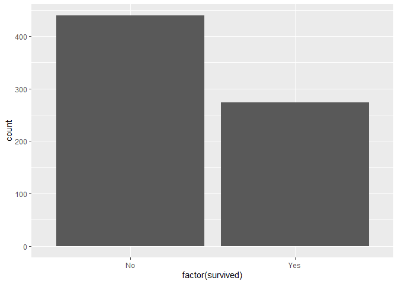
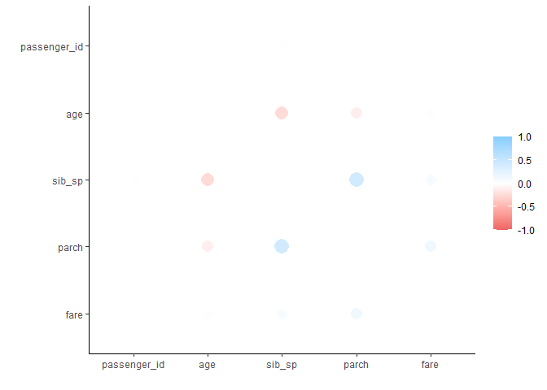

PSTAT 131 Homework Three: Classification
================
Carly Greutert

``` r
library(tidymodels)
```

    ## -- Attaching packages -------------------------------------- tidymodels 0.2.0 --

    ## v broom        0.7.12     v recipes      0.2.0 
    ## v dials        0.1.1      v rsample      0.1.1 
    ## v dplyr        1.0.8      v tibble       3.1.6 
    ## v ggplot2      3.3.5      v tidyr        1.2.0 
    ## v infer        1.0.0      v tune         0.2.0 
    ## v modeldata    0.1.1      v workflows    0.2.6 
    ## v parsnip      0.2.1      v workflowsets 0.2.1 
    ## v purrr        0.3.4      v yardstick    0.0.9

    ## -- Conflicts ----------------------------------------- tidymodels_conflicts() --
    ## x purrr::discard() masks scales::discard()
    ## x dplyr::filter()  masks stats::filter()
    ## x dplyr::lag()     masks stats::lag()
    ## x recipes::step()  masks stats::step()
    ## * Learn how to get started at https://www.tidymodels.org/start/

``` r
library(ISLR) # For the Smarket data set
library(ggplot2)
library(discrim)
```

    ## 
    ## Attaching package: 'discrim'

    ## The following object is masked from 'package:dials':
    ## 
    ##     smoothness

``` r
library(corrr)
library(klaR) # for naive bayes
```

    ## Loading required package: MASS

    ## 
    ## Attaching package: 'MASS'

    ## The following object is masked from 'package:dplyr':
    ## 
    ##     select

``` r
library(caret)
```

    ## Loading required package: lattice

    ## 
    ## Attaching package: 'caret'

    ## The following objects are masked from 'package:yardstick':
    ## 
    ##     precision, recall, sensitivity, specificity

    ## The following object is masked from 'package:purrr':
    ## 
    ##     lift

``` r
library(dplyr)
library(ggplot2)
library(tidyverse)
```

    ## -- Attaching packages --------------------------------------- tidyverse 1.3.1 --

    ## v readr   2.1.1     v forcats 0.5.1
    ## v stringr 1.4.0

    ## -- Conflicts ------------------------------------------ tidyverse_conflicts() --
    ## x readr::col_factor() masks scales::col_factor()
    ## x purrr::discard()    masks scales::discard()
    ## x dplyr::filter()     masks stats::filter()
    ## x stringr::fixed()    masks recipes::fixed()
    ## x dplyr::lag()        masks stats::lag()
    ## x caret::lift()       masks purrr::lift()
    ## x MASS::select()      masks dplyr::select()
    ## x readr::spec()       masks yardstick::spec()

``` r
library(corrplot)
```

    ## corrplot 0.92 loaded

``` r
library(ggthemes)
library(cli)
library(recipes)
library(yardstick)
library(MASS)
tidymodels_prefer()
```

``` r
titanic <- read_csv('C:\\Program Files\\Git\\tmp\\131-hw3\\titanic.csv')
```

    ## Rows: 891 Columns: 12
    ## -- Column specification --------------------------------------------------------
    ## Delimiter: ","
    ## chr (6): survived, name, sex, ticket, cabin, embarked
    ## dbl (6): passenger_id, pclass, age, sib_sp, parch, fare
    ## 
    ## i Use `spec()` to retrieve the full column specification for this data.
    ## i Specify the column types or set `show_col_types = FALSE` to quiet this message.

``` r
names <- c('pclass', 'survived')
titanic[,names] <- lapply(titanic[,names] , factor)
```

Note I used
<https://www.listendata.com/2015/05/converting-multiple-numeric-variables.html#>:\~:text=In%20R%2C%20you%20can%20convert%20multiple%20numeric%20variables,functions.%20They%20perform%20multiple%20iterations%20%28loops%29%20in%20R
to learn about using the lapply function.

1.  

``` r
set.seed(777)
titanic_split <- initial_split(titanic, prop = 0.80, strata = 'survived')
titanic_train <- training(titanic_split)
titanic_test <- testing(titanic_split)
```

Note that since the training data is 80% of the data set observations
and titanic_train has 891\*0.8\~712 observations and titanic_test is
891\*0.2\~179 observations.

``` r
sum(is.na(titanic_train$passenger_id))
```

    ## [1] 0

``` r
sum(is.na(titanic_train$survived))
```

    ## [1] 0

``` r
sum(is.na(titanic_train$pclass))
```

    ## [1] 0

``` r
sum(is.na(titanic_train$name))
```

    ## [1] 0

``` r
sum(is.na(titanic_train$sex))
```

    ## [1] 0

``` r
sum(is.na(titanic_train$age))
```

    ## [1] 147

``` r
sum(is.na(titanic_train$sib_sp))
```

    ## [1] 0

``` r
sum(is.na(titanic_train$parch))
```

    ## [1] 0

``` r
sum(is.na(titanic_train$ticket))
```

    ## [1] 0

``` r
sum(is.na(titanic_train$fare))
```

    ## [1] 0

``` r
sum(is.na(titanic_train$cabin))
```

    ## [1] 562

``` r
sum(is.na(titanic_train$embarked))
```

    ## [1] 1

Note that there are a significant number of observations missing for
age, but a significant amount more for cabin. All other column
observations either have 0 or 1 missing observations. Also, it is clear
that we should use stratified sampling for this data set because of the
diverse set of influences on whether or not a passenger survived based
on different variables (i.e. sex, age, pclass, etc). Thus, our sample
should include a diverse mix of these possible influences.  
2.

``` r
titanic_train %>% ggplot(aes(x = factor(survived)))+ stat_count(geom = "bar")
```

<!-- -->

From the distribution of our outcome variable, survived, there were
significantly more passengers who did not survive, as opposed to those
who did.  
3.

``` r
titanic_cor <- titanic_train %>%
  select(-survived) %>%
  select(-pclass)%>%
  select(-sex) %>%
  select(-embarked) %>%
  select(-cabin) %>%
  select(-ticket) %>%
  select(-name) %>%
  correlate(use = "pairwise.complete.obs",
  method = "pearson")
```

    ## 
    ## Correlation method: 'pearson'
    ## Missing treated using: 'pairwise.complete.obs'

``` r
rplot(titanic_cor)
```

    ## Don't know how to automatically pick scale for object of type noquote. Defaulting to continuous.

<!-- -->

I notice that the variables parch and sib_sp are positively correlated
and parch and age, as well as age and sib_sp are negatively correlated
(i.e in the increasing and decreasing direction, respectively).  
4.

``` r
titanic_recipe <- recipe(survived ~ pclass + sex + age + sib_sp + parch + fare, data = titanic_train)
titanic_recipe <- titanic_recipe %>%
  step_impute_linear(age) %>%
  step_dummy(all_nominal_predictors())%>%
  step_interact(~sex:fare) %>%
  step_interact(~age:fare)
titanic_recipe
```

    ## Recipe
    ## 
    ## Inputs:
    ## 
    ##       role #variables
    ##    outcome          1
    ##  predictor          6
    ## 
    ## Operations:
    ## 
    ## Linear regression imputation for age
    ## Dummy variables from all_nominal_predictors()
    ## Interactions with sex:fare
    ## Interactions with age:fare

5.  

``` r
log_reg <- logistic_reg() %>% 
  set_engine("glm") %>% 
  set_mode("classification")
log_wkflow <- workflow() %>% 
  add_model(log_reg) %>% 
  add_recipe(titanic_recipe)
log_fit <- fit(log_wkflow, titanic_train)
```

    ## Warning: Interaction specification failed for: ~sex:fare. No interactions will
    ## be created.

6.  
